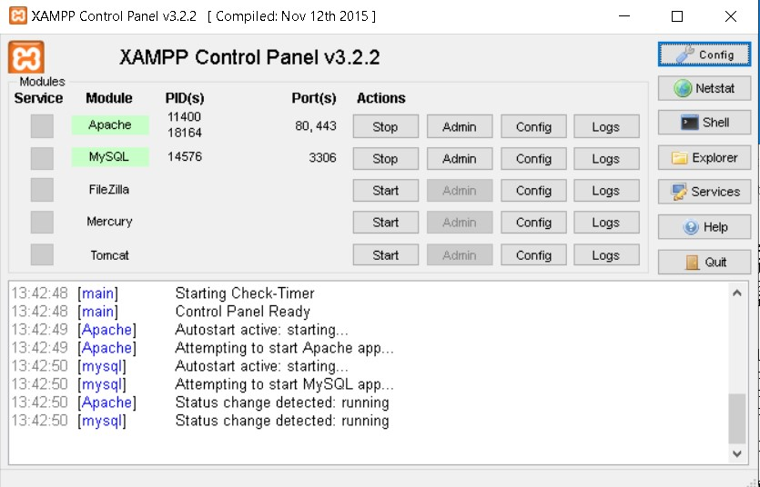
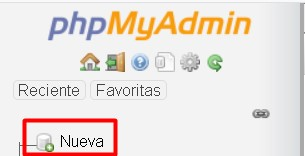
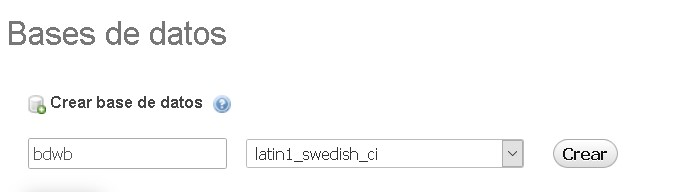

## Framework utilizado

Este proyecto fue desarrollado mediante Laravel 7.30.4.

## Cómo correr el proyecto

Primero que todo, asegurarse de que el proyecto esté en la carpeta *xampp\htdocs*.

1. Abrir XAMPP y activar Apache y MySQL.

<p align="center"><a target="_blank"></a></p>

2. Ingresar, a través del navegador, a *localhost/phpmyadmin*.

3. Una vez allí, seleccionar "Nueva", para crear una nueva base de datos.

<p align="center"><a target="_blank"></a></p>

4. Crear una base de datos de nombre "bdwb".

<p align="center"><a target="_blank"></a></p>

5. Dentro del proyecto, ejecutar los siguientes comandos:
```
composer install
copy NUL .env
cp .env.example .env
php artisan migrate
php artisan serve
```
6. Estos comandos instalarán los paquetes correspondientes, crearán las tablas y ejecutarán el proyecto, respectivamente. Luego, éste estará disponible en el navegador mediante el enlace *localhost:8000*.

## Ejecutar pruebas

En el proyecto hay dos pruebas, presentes en *tests/Feature/PersonajeModuleTest.php*:

1. Una prueba que analiza si un personaje se puede ver estando autenticado.

2. Una prueba que analiza si existe redirección en caso de intentar acceder a la vista de personaje sin estar autenticado.

Para ejecutar estas pruebas se debe ingresar el comando:
```
vendor\bin\phpunit
```
